Final Report
================
Noam Hazan, Jacob Doh, Nicolas Halabi, Sebastian Naranjo

# Analysis of Income & Other Factors in Census Data

#### Noam Hazan, Jacob Doh, Nicolas Halabi, Sebastian Naranjo

## Introduction

The project aims to identify factors that influence income, and identify
the ways they impact income, as well as the key issues they represent.
This can provide us insight into life across American (United States)
society in the modern age. The questions which we honed in on were the
following:

- Question 1 (Noam Hazan): How do income factors relate to commute
  behaviors? What is the relationship between commute time to work
  (JWMNP) and income?

- Question 2 (Noam Hazan): Is assistance income (i.e. Social Security,
  Supplementary Security, Public Assistance) distributed more to
  employed or unemployed people? How is the proportion of assistance
  income and total income related to employment status?

- Question 3 (Jacob Doh): How does educational attainment relate to
  income? Do higher education levels tend to earn higher income?

- Question 4 (Jacob Doh): How does income relate to poverty status? Do
  average income levels differ across poverty groups?

- Question 5 (Nicolas Halabi): How does vehicle ownership relate to
  commuters income?

- Question 6 (Nicolas Halabi): How does ones employment class relate to
  their income.

- Question 7 (Sebastian Naranjo): How does an individual’s race relate
  to their income?

- Question 8 (Sebastian Naranjo): How does income vary across every
  region in America?

By investigating how income intersects with logistics, social equity,
and employment status, these questions provide the empirical evidence
needed to fulfill our goal of identifying the core factors that shape
economic hierarchy and define the modern American experience.

## Data

This project uses data from the US Census Bureau’s [American Community
Survey (ACS) 5-Year Public Use Microdata Sample
(2022)](https://data.census.gov/app/mdat/ACSPUMS5Y2022/vars). This
dataset, which aggregates 60 months of collected data, is separated by
two levels: an individual and household layer, each of which is a
representation of the United States as a whole.

As a note, we were specific in choosing the 5 year estimate on account
of the fact that it is the largest and most reliable sample size, and
because for our analytic purposes precision is more important than
currency.

### Data Characteristics

The dataset is wide and unfocused, holding over 500 unique fields which
cover anything from demographic factors to socioeconomic conditions to
housing status to transportation behavior to many more items. The
granularity of the de-identified dataset allows us to dive deeper into
analysis on a per person basis, though geographical regions are
restricted to areas of +100,000 or more people.

The dataset is also very detailed in its length, with ~16 million
records each representing at least one unique person, and a sample model
weight which can be used to represent over ~331 million Americans.

### Data Access Methods

Due to the size of the dataset (~10GB for personal section as an
unzipped CSV), methods for accessing the data are important to consider.
Since holding large amounts of data (+8GB) is not ideal for memory, we
have opted to use a database system, DuckDB, which stores tables on the
device’s internal drive and quickly accesses them for use in R.

Our dataflow (simplified model pictured below) for all methods of data
access involve bringing in the data to the database, then querying for
much more reasonable sized tables which can then be analyzed in R.

<figure>

<figcaption aria-hidden="true">Simplified Dataflow Model</figcaption>
</figure>

#### FTP

The [FTP (File Transfer
Protocol)](https://www2.census.gov/programs-surveys/acs/data/pums/2022/5-Year/)
is the most obvious access method, since it provides the data in full
(i.e. all columns, all rows). Unfortunately, that means it is loading
all the data at once which can take hours in non-ideal conditions.

Despite the conditions, this provides the fullest picture which helps
when beginning analysis. For that reason, we have opted to use this as
our main method of collecting the data and putting it into storage.

#### API

The US Census Bureau also provides the ability to query through their
API system. While this is ideal, since it ensures we only download and
store data we need, it limits us to query only 50 columns at once.
Considering there are times we want to see up to ~300 at a time, this is
fairly restrictive.

Multiple tools exist for interacting with the API, and of course, we
have the ability to build our own custom tools. Due to the fact that
this isn’t our primary query method, we decided that we would not
benefit from a custom solution, and as such we will use either
`tidycensus` or `censusapi` packages in those cases.

#### MDAT

We are also able to use the MDAT or Micro-Data Access Tool. This
provides a comprehensive UI to interact with the data, but restricts our
speed to access data to a level where we feel it is unusable, at least
for our usage. This tool is useful for easily reading about the columns
and their related values, but loses any other value in areas further
then that.

### Securing & Cleaning Process(es)

This creates a file `main.duckdb` which will act as the store for data
that is more efficient then a CSV in most respects. The connection needs
to be open to interact with the database and should subsequently be
closed to ensure results and changes are saved.

``` r
# Open the connection
con <- dbConnect(duckdb(), dbdir = "main.duckdb", read_only = FALSE)
```

We also need to download & setup files for next steps using the link for
the data via the FTP, in this case 2022, 5-Year, personal level, and for
the whole United States. Due to the size of the data, this may take some
time to run. Upon success you should see a folder `data` in the
directory as well as `dict.csv`.

``` r
# Download the zip files from FTP
multi_download("https://www2.census.gov/programs-surveys/acs/data/pums/2022/5-Year/csv_pus.zip", "csv_pus.zip", resume = TRUE, progress = TRUE)

# Download the data dictionary
multi_download("https://www2.census.gov/programs-surveys/acs/tech_docs/pums/data_dict/PUMS_Data_Dictionary_2018-2022.csv", "dict.csv", resume = TRUE, progress = TRUE)

# Unzip results into folder 'data'
unzip("csv_pus.zip", exdir = "data")
```

Now we bring the data into the DuckDB database and combine it into one
table for easy access. This is done via a simple SQL union between the 4
split CSVs.

> \[!WARNING\] Be warned, this can take anywhere from 30-90 minutes
> depending on your device (i.e. memory \[RAM\] and storage \[SSD/HHD\]
> characteristics)

``` r
dbExecute(con, "
CREATE OR REPLACE TABLE main AS
  SELECT * FROM 'data/psam_pusa.csv'
  UNION
  SELECT * FROM 'data/psam_pusb.csv'
  UNION
  SELECT * FROM 'data/psam_pusc.csv'
  UNION
  SELECT * FROM 'data/psam_pusd.csv'
")
# ONLY RUN FOR SET UP AND THEN RUN CLOSE CONNECTION. This will store the results out of memory (i.e. internal drive storage). DuckDB handles quick queries to bring into memory. Be cognizant about usage of tables in memory!

# Test the connection and see if the query ran correctly
dbGetQuery(con, "SELECT * FROM main LIMIT 100")
```

Close the connection to ensure results are stored safely. Reopen the
connection to keep interacting with the database.

``` r
# Close the connection (Use at the end)
dbDisconnect(con, shutdown = TRUE)
# Remember to open the connection again when interacting with DuckDB
```

#### Translation Processes

To convert the data dictionary to a usable form in R we need to break
down the odd structure of the `dict.csv`. In analyzing results, use
`dict_desc` to see variables and descriptions. Translations for the
dataset can be done via the `translate` function which uses the
`translation` item, simply plug the `target_df` as the first parameter
and a translated data frame will be returned.

``` r
d1 <- read.csv("dict.csv", header = FALSE, fill = TRUE)

# Dictionary item description, for analysis use. Contains every variable name and the given description by the census, as well as a short version for graphs
dict_desc <- d1 |> 
  filter(V1 == "NAME") |> select(V2, V5) |> rename(Variable = V2, Description = V5) |> mutate(ShortDescription = gsub("\\s*\\(.*?\\)", "", Description))

# Create translation table to be used in the function
translation <- d1 |> 
  filter(
    V1 == "VAL", # Where VAL
    (V3 == "C" | (V3 == "N" & is.na(suppressWarnings(as.numeric(V5))))),
    V5 == V6) |> # min value == max, eliminates limited odd occurrences
  select(V2, V5, V7) |> rename(Variable = V2, Key = V5, Value = V7)

# function to translate a target_df
translate <- function(target_df) {
  # Create a copy, just for security
  return_df <- target_df
  
  # Find the columns in common
  cols_to_translate <- intersect(
    unique(translation$Variable), 
    colnames(return_df)
    )
  
  for (col in cols_to_translate) {
    current <- translation |> filter(Variable == col)
    lookup <- setNames(as.character(current$Value), current$Key)

    translate_result <- lookup[as.character(return_df[[col]])]
    
    return_df[[col]] <- ifelse(
      is.na(translate_result), # if is na 
      return_df[[col]], # original
      translate_result) # otherwise use translated
    
  }
  return(return_df)
}

rm(d1) # Remove data that was used for processing, but is not useful anymore in order to free up more memory.
```

## Analysis

Variable Usage:

- Total Income \[PINCP\] (ALL SUB NEED ADJUSTMENT VIA ADJINC)
  - Salary Income \[WAGP\]
  - Self Employed Income \[SEMP\]
  - Retirement Income \[RETP\]
  - Social Security Income \[SSP\]
  - Interest, Dividends, Rental Income \[INTP\]
  - All Other Income \[OIP\]
  - *Assistance Incomes*
    - Public Assistance Income \[PAP\]
    - Supplementary Security Income \[SSIP\]
- Total Earnings \[PERNP\] (NEEDS ADJUSTMENT VIA ADJINC)
- Income-to- Poverty Ratio \[POVPIP\]
- *Commute Factors*
  - Travel Time to Work \[JWMNP\]
  - Education Attainment \[SCHL\]
  - Vehicle Occupancy \[JWRIP\]
  - Means of Transportation to Work \[JWTRNS\]
  - Number of Vehicles (Calculated) \[DRIVESP\]
- *Employment*
  - Class of Worker \[COW\]
  - Employment Status \[ESR\]
  - Place of Work (ST) \[POWSP\]
- Utility Class
  - Person Weight (i.e. the amount of people a record represents)
    \[PWGTP\]
  - Adjustment factor for Income & Earnings \[ADJINC\]

### Income & Commute (Noam Hazan)

How do income factors relate to commute behaviors? What is the
relationship between commute time to work (JWMNP) and income?

We query for all the necessary variables and make adjustments as needed,
such as with the Adjustment factor for Income & Earnings \[ADJINC\]. The
ADJINC represents an inflation adjustment factor for the period, since
this data was collected over a 5 year period. Post-query run, we
translate the data frame and use it graph building.

``` r
translation |> filter(Variable == 'JWTRNS')

# Query for the data
m1 <- dbGetQuery(con, "
  SELECT 
    PWGTP, 
    POVPIP, JWMNP, JWRIP, JWTRNS, DRIVESP, COW, ESR, POWSP, 
    INTP * (ADJINC / 1000000) AS INTP_adjusted,
    OIP * (ADJINC / 1000000) AS OIP_adjusted, 
    PAP * (ADJINC / 1000000) AS PAP_adjusted, 
    PERNP * (ADJINC / 1000000) AS PERNP_adjusted, 
    PINCP * (ADJINC / 1000000) AS PINCP_adjusted, 
    RETP * (ADJINC / 1000000) AS RETP_adjusted, 
    SEMP * (ADJINC / 1000000) AS SEMP_adjusted, 
    SSIP * (ADJINC / 1000000) AS SSIP_adjusted, 
    SSP * (ADJINC / 1000000) AS SSP_adjusted, 
    WAGP * (ADJINC / 1000000) AS WAGP_adjusted
  FROM main 
  WHERE
    ESR = '1' -- Make sure we look at people who are employed
    AND JWTRNS NOT IN ('bb', '12', '06', '04') -- exclude those who record commute method as N/A, 'Other method', or uncommon types like 'Ferryboat' or 'Long-distance Train'
")

# Translate for readability
m1 <- translate(m1)
```

``` r
g1.bin_width <- 15 # Bin width for minutes to commute to work [JWMNP]
```

``` r
  read_csv("exported-graph-construction-data/m1-1.csv") |>
  mutate(
    sort_key = as.numeric(str_extract(JWMNP_bin, "\\d+")),
    JWMNP_bin = fct_reorder(JWMNP_bin, sort_key)
  ) |> 
  filter_out(
    JWMNP_bin == "(195,210]", 
  ) |> 
  ggplot(aes(y=avg_weighted_PINCP_adjusted, x=JWMNP_bin, group = 1)) + 
  geom_line(color=ft_cols$yellow) + geom_point(color=ft_cols$yellow) + 
  theme(axis.text.x = element_text(angle = 45)) +
  labs(
    title=str_wrap("Average Total Income & Travel Time to Work", 70),
    subtitle=str_wrap(str_glue("Average Persons Total Income [PINCP] Adjusted and Travel Time to Work [JWMNP] (Nearest {g1.bin_width} Minutes)"), 70),
    x=str_glue("Travel time to work [JWMNP] ({g1.bin_width} Minute Bins)"),
    y="Average Total Income [PINCP] Adjusted" 
  ) + 
  scale_y_continuous(labels = scales::label_number(scale_cut = scales::cut_short_scale()))
```

    ## Rows: 14 Columns: 2
    ## ── Column specification ────────────────────────────────────────────────────────
    ## Delimiter: ","
    ## chr (1): JWMNP_bin
    ## dbl (1): avg_weighted_PINCP_adjusted
    ## 
    ## ℹ Use `spec()` to retrieve the full column specification for this data.
    ## ℹ Specify the column types or set `show_col_types = FALSE` to quiet this message.

    ## Warning: There was 1 warning in `mutate()`.
    ## ℹ In argument: `JWMNP_bin = fct_reorder(JWMNP_bin, sort_key)`.
    ## Caused by warning:
    ## ! `fct_reorder()` removing 1 missing value.
    ## ℹ Use `.na_rm = TRUE` to silence this message.
    ## ℹ Use `.na_rm = FALSE` to preserve NAs.

    ## Warning in grid.Call(C_stringMetric, as.graphicsAnnot(x$label)): font family
    ## 'Roboto Condensed Light' not found, will use 'sans' instead
    ## Warning in grid.Call(C_stringMetric, as.graphicsAnnot(x$label)): font family
    ## 'Roboto Condensed Light' not found, will use 'sans' instead
    ## Warning in grid.Call(C_stringMetric, as.graphicsAnnot(x$label)): font family
    ## 'Roboto Condensed Light' not found, will use 'sans' instead
    ## Warning in grid.Call(C_stringMetric, as.graphicsAnnot(x$label)): font family
    ## 'Roboto Condensed Light' not found, will use 'sans' instead
    ## Warning in grid.Call(C_stringMetric, as.graphicsAnnot(x$label)): font family
    ## 'Roboto Condensed Light' not found, will use 'sans' instead
    ## Warning in grid.Call(C_stringMetric, as.graphicsAnnot(x$label)): font family
    ## 'Roboto Condensed Light' not found, will use 'sans' instead
    ## Warning in grid.Call(C_stringMetric, as.graphicsAnnot(x$label)): font family
    ## 'Roboto Condensed Light' not found, will use 'sans' instead
    ## Warning in grid.Call(C_stringMetric, as.graphicsAnnot(x$label)): font family
    ## 'Roboto Condensed Light' not found, will use 'sans' instead
    ## Warning in grid.Call(C_stringMetric, as.graphicsAnnot(x$label)): font family
    ## 'Roboto Condensed Light' not found, will use 'sans' instead
    ## Warning in grid.Call(C_stringMetric, as.graphicsAnnot(x$label)): font family
    ## 'Roboto Condensed Light' not found, will use 'sans' instead
    ## Warning in grid.Call(C_stringMetric, as.graphicsAnnot(x$label)): font family
    ## 'Roboto Condensed Light' not found, will use 'sans' instead
    ## Warning in grid.Call(C_stringMetric, as.graphicsAnnot(x$label)): font family
    ## 'Roboto Condensed Light' not found, will use 'sans' instead
    ## Warning in grid.Call(C_stringMetric, as.graphicsAnnot(x$label)): font family
    ## 'Roboto Condensed Light' not found, will use 'sans' instead
    ## Warning in grid.Call(C_stringMetric, as.graphicsAnnot(x$label)): font family
    ## 'Roboto Condensed Light' not found, will use 'sans' instead

    ## Warning in grid.Call(C_textBounds, as.graphicsAnnot(x$label), x$x, x$y, : font
    ## family 'Roboto Condensed Light' not found, will use 'sans' instead
    ## Warning in grid.Call(C_textBounds, as.graphicsAnnot(x$label), x$x, x$y, : font
    ## family 'Roboto Condensed Light' not found, will use 'sans' instead
    ## Warning in grid.Call(C_textBounds, as.graphicsAnnot(x$label), x$x, x$y, : font
    ## family 'Roboto Condensed Light' not found, will use 'sans' instead

    ## Warning in grid.Call.graphics(C_text, as.graphicsAnnot(x$label), x$x, x$y, :
    ## font family 'Roboto Condensed Light' not found, will use 'sans' instead
    ## Warning in grid.Call.graphics(C_text, as.graphicsAnnot(x$label), x$x, x$y, :
    ## font family 'Roboto Condensed Light' not found, will use 'sans' instead
    ## Warning in grid.Call.graphics(C_text, as.graphicsAnnot(x$label), x$x, x$y, :
    ## font family 'Roboto Condensed Light' not found, will use 'sans' instead
    ## Warning in grid.Call.graphics(C_text, as.graphicsAnnot(x$label), x$x, x$y, :
    ## font family 'Roboto Condensed Light' not found, will use 'sans' instead
    ## Warning in grid.Call.graphics(C_text, as.graphicsAnnot(x$label), x$x, x$y, :
    ## font family 'Roboto Condensed Light' not found, will use 'sans' instead
    ## Warning in grid.Call.graphics(C_text, as.graphicsAnnot(x$label), x$x, x$y, :
    ## font family 'Roboto Condensed Light' not found, will use 'sans' instead
    ## Warning in grid.Call.graphics(C_text, as.graphicsAnnot(x$label), x$x, x$y, :
    ## font family 'Roboto Condensed Light' not found, will use 'sans' instead

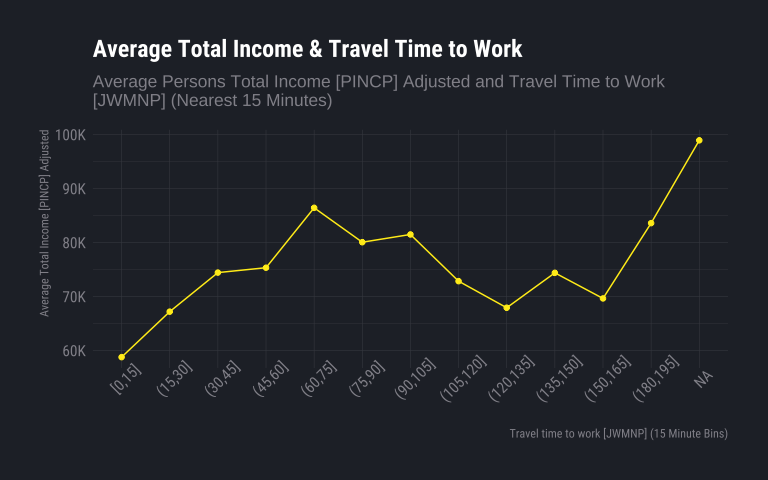<!-- -->

This graph shows the relationship between travel time to work (in
minutes) and average total income. We clearly see income start at its
lowest point with the smallest commutes rising to a local peak of
~\$85,000 within an hour commute time. Average income doesn’t rise back
up until we get commutes 3 hours or longer. NA in this case represents
primarily people who worked from home, whose average income represents
one of the highest points, only challenged by 3 hours or more.

It’s likely that those who have the opportunity to work from home are in
white-collar roles, which on average have higher income, contributing to
that data point. Higher end values for travel time could be attributed
to high-travel roles, usually those of managers or consultants, though
we can’t confirm this observation through our data directly.

We could also hypothesize that people are more likely to travel further
distances to work for higher incomes. The high income can act as an
incentive that trumps a long commute. Once again, it is not possible to
make a concrete observation via our data.

``` r
  read_csv("exported-graph-construction-data/m1-2.csv") |>
  mutate(
    sort_key = as.numeric(str_extract(JWMNP_bin, "\\d+")),
    JWMNP_bin = fct_reorder(JWMNP_bin, sort_key)
  ) |> filter_out(
    JWMNP_bin == "(195,210]"
  ) |> 
  ggplot(aes(
    x=JWMNP_bin, ymin = ymin, ymax = ymax,
    lower = lower, middle = middle, upper = upper
  )) + 
  geom_boxplot(stat = "identity", color=ft_cols$white, fill="#252a32") + 
  labs(
    title= "Total Income Across Commute Time",
    x=str_glue("Travel time to work [JWMNP] ({g1.bin_width} Minute Bins)"),
    y= "Total Income [PINCP] Adjusted",
  ) +
  scale_y_continuous(labels = scales::label_number(scale_cut = scales::cut_short_scale()))
```

    ## Rows: 14 Columns: 6
    ## ── Column specification ────────────────────────────────────────────────────────
    ## Delimiter: ","
    ## chr (1): JWMNP_bin
    ## dbl (5): ymin, lower, middle, upper, ymax
    ## 
    ## ℹ Use `spec()` to retrieve the full column specification for this data.
    ## ℹ Specify the column types or set `show_col_types = FALSE` to quiet this message.

    ## Warning: There was 1 warning in `mutate()`.
    ## ℹ In argument: `JWMNP_bin = fct_reorder(JWMNP_bin, sort_key)`.
    ## Caused by warning:
    ## ! `fct_reorder()` removing 1 missing value.
    ## ℹ Use `.na_rm = TRUE` to silence this message.
    ## ℹ Use `.na_rm = FALSE` to preserve NAs.

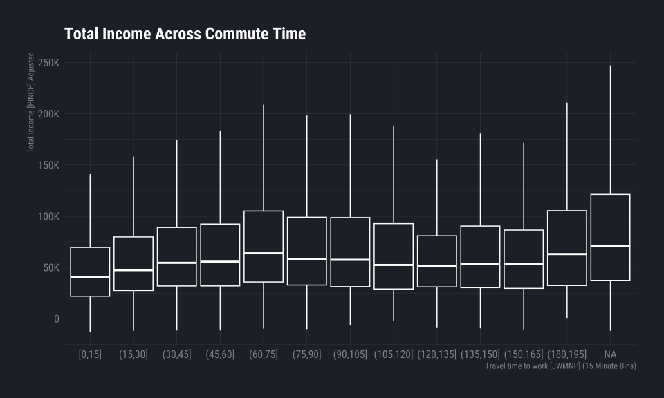<!-- -->

This boxplot shows a similar picture to the previous graph, where we
look at the travel time to work in minutes, but this time against a
(non-average) total income. Again, we see a similar trend, though here
we can observe that the minimum in less sensitive to different travel
times. On the opposite end we see the max is much more sensitive,
showing a heights at the sames peaks as in the previous graphs.

Similarly we observe NA, or those who work from home, with the highest
point max & median, but now also as the lowest min point (going furthest
into negative income). Further analysis on this is done in Supplementary
Exhibits, see Exhibit A.

``` r
# Looking at total income [PINCP] & means of transportation [JWTRNS] 
  read_csv("exported-graph-construction-data/m1-3.csv") |>
  ggplot(aes(
    x=reorder(JWTRNS, middle), ymin = ymin, ymax = ymax,
    lower = lower, middle = middle, upper = upper
  )) + 
  geom_boxplot(stat = "identity", color=ft_cols$white, fill="#252a32") + 
  labs(
    title="Total Income Across Means of Transportation",
    y="Total Income [PINCP] Adjusted",
    x="Means of Transportation to Work [JWTRNS]"
  ) + scale_y_continuous(labels = scales::label_number(scale_cut = scales::cut_short_scale())) +
  coord_flip()
```

    ## Rows: 9 Columns: 6
    ## ── Column specification ────────────────────────────────────────────────────────
    ## Delimiter: ","
    ## chr (1): JWTRNS
    ## dbl (5): ymin, lower, middle, upper, ymax
    ## 
    ## ℹ Use `spec()` to retrieve the full column specification for this data.
    ## ℹ Specify the column types or set `show_col_types = FALSE` to quiet this message.

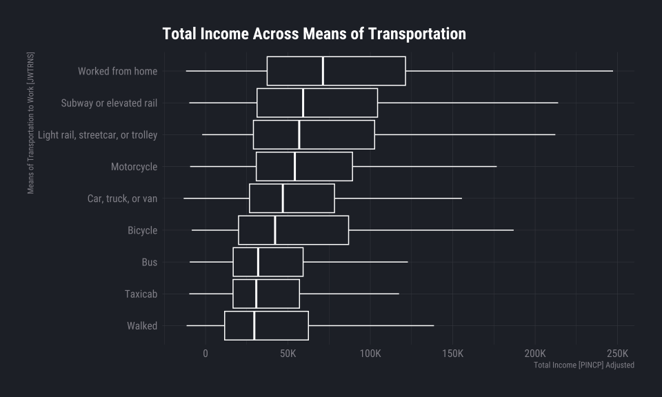<!-- -->

This boxplot shows a comparison between means of transportation to work
and a persons total income. We can see the same observations we’ve made
before on those who worked from home, however now we can look at other
modes.

Least surprising is car, truck, or van being directly in the middle, due
to the car-centric environment we’ve cultivated in the United States.
The average American, whether high, middle, or low class has (or is
expected to have) a car, which amounts to a very average income range
and median in this plot.

Walking is the cheapest option here, since it requires no equipment, no
fares to be paid, and is available in all situations. While it makes
sense to see its median and lower bound (Q1) be the lowest, it comes
with a bit of surprise. One could suppose that someone with high income
has more opportunity to pick where they live and their proximity to
work, and therefore might be more able to be in walking distances of
their workplace, yet we do not see this relationship.

### Assistance Income & Employment Status (Noam Hazan)

``` r
g2.bin_width <- 1000 # Bin width income
```

``` r
  read_csv("exported-graph-construction-data/m2-1.csv") |>
  ggplot(aes(x=Income, y=PWGTP)) + geom_col(color=NA, fill=ft_cols$yellow) + facet_grid(vars(name), vars(ESR)) + 
  labs(
    title="Assistance Income Distribution Across Employment Status",
    subtitle=str_wrap(str_glue("Distribution of Public Assistance [PAP] and Supplementary Security Income [SSIP] by employment status [ESR] for those who collect any assistance"), 90),
    x="Assistance Income Amount ($)",
    y="Person Count",
    caption=str_glue("Incomes rounded to nearest ${g2.bin_width}, Removed figures with 1000 people or less")
  ) + 
  scale_y_continuous(labels = scales::label_number(scale_cut = scales::cut_short_scale())) +
  scale_x_continuous(labels = scales::label_number(scale_cut = scales::cut_short_scale()))
```

    ## Rows: 921 Columns: 4
    ## ── Column specification ────────────────────────────────────────────────────────
    ## Delimiter: ","
    ## chr (2): ESR, name
    ## dbl (2): PWGTP, Income
    ## 
    ## ℹ Use `spec()` to retrieve the full column specification for this data.
    ## ℹ Specify the column types or set `show_col_types = FALSE` to quiet this message.

    ## Warning in grid.Call(C_stringMetric, as.graphicsAnnot(x$label)): font family
    ## 'Roboto Condensed Light' not found, will use 'sans' instead
    ## Warning in grid.Call(C_stringMetric, as.graphicsAnnot(x$label)): font family
    ## 'Roboto Condensed Light' not found, will use 'sans' instead
    ## Warning in grid.Call(C_stringMetric, as.graphicsAnnot(x$label)): font family
    ## 'Roboto Condensed Light' not found, will use 'sans' instead
    ## Warning in grid.Call(C_stringMetric, as.graphicsAnnot(x$label)): font family
    ## 'Roboto Condensed Light' not found, will use 'sans' instead
    ## Warning in grid.Call(C_stringMetric, as.graphicsAnnot(x$label)): font family
    ## 'Roboto Condensed Light' not found, will use 'sans' instead
    ## Warning in grid.Call(C_stringMetric, as.graphicsAnnot(x$label)): font family
    ## 'Roboto Condensed Light' not found, will use 'sans' instead
    ## Warning in grid.Call(C_stringMetric, as.graphicsAnnot(x$label)): font family
    ## 'Roboto Condensed Light' not found, will use 'sans' instead
    ## Warning in grid.Call(C_stringMetric, as.graphicsAnnot(x$label)): font family
    ## 'Roboto Condensed Light' not found, will use 'sans' instead
    ## Warning in grid.Call(C_stringMetric, as.graphicsAnnot(x$label)): font family
    ## 'Roboto Condensed Light' not found, will use 'sans' instead
    ## Warning in grid.Call(C_stringMetric, as.graphicsAnnot(x$label)): font family
    ## 'Roboto Condensed Light' not found, will use 'sans' instead
    ## Warning in grid.Call(C_stringMetric, as.graphicsAnnot(x$label)): font family
    ## 'Roboto Condensed Light' not found, will use 'sans' instead
    ## Warning in grid.Call(C_stringMetric, as.graphicsAnnot(x$label)): font family
    ## 'Roboto Condensed Light' not found, will use 'sans' instead
    ## Warning in grid.Call(C_stringMetric, as.graphicsAnnot(x$label)): font family
    ## 'Roboto Condensed Light' not found, will use 'sans' instead
    ## Warning in grid.Call(C_stringMetric, as.graphicsAnnot(x$label)): font family
    ## 'Roboto Condensed Light' not found, will use 'sans' instead

    ## Warning in grid.Call(C_textBounds, as.graphicsAnnot(x$label), x$x, x$y, : font
    ## family 'Roboto Condensed Light' not found, will use 'sans' instead
    ## Warning in grid.Call(C_textBounds, as.graphicsAnnot(x$label), x$x, x$y, : font
    ## family 'Roboto Condensed Light' not found, will use 'sans' instead
    ## Warning in grid.Call(C_textBounds, as.graphicsAnnot(x$label), x$x, x$y, : font
    ## family 'Roboto Condensed Light' not found, will use 'sans' instead
    ## Warning in grid.Call(C_textBounds, as.graphicsAnnot(x$label), x$x, x$y, : font
    ## family 'Roboto Condensed Light' not found, will use 'sans' instead
    ## Warning in grid.Call(C_textBounds, as.graphicsAnnot(x$label), x$x, x$y, : font
    ## family 'Roboto Condensed Light' not found, will use 'sans' instead

    ## Warning in grid.Call.graphics(C_text, as.graphicsAnnot(x$label), x$x, x$y, :
    ## font family 'Roboto Condensed Light' not found, will use 'sans' instead
    ## Warning in grid.Call.graphics(C_text, as.graphicsAnnot(x$label), x$x, x$y, :
    ## font family 'Roboto Condensed Light' not found, will use 'sans' instead
    ## Warning in grid.Call.graphics(C_text, as.graphicsAnnot(x$label), x$x, x$y, :
    ## font family 'Roboto Condensed Light' not found, will use 'sans' instead
    ## Warning in grid.Call.graphics(C_text, as.graphicsAnnot(x$label), x$x, x$y, :
    ## font family 'Roboto Condensed Light' not found, will use 'sans' instead
    ## Warning in grid.Call.graphics(C_text, as.graphicsAnnot(x$label), x$x, x$y, :
    ## font family 'Roboto Condensed Light' not found, will use 'sans' instead
    ## Warning in grid.Call.graphics(C_text, as.graphicsAnnot(x$label), x$x, x$y, :
    ## font family 'Roboto Condensed Light' not found, will use 'sans' instead
    ## Warning in grid.Call.graphics(C_text, as.graphicsAnnot(x$label), x$x, x$y, :
    ## font family 'Roboto Condensed Light' not found, will use 'sans' instead
    ## Warning in grid.Call.graphics(C_text, as.graphicsAnnot(x$label), x$x, x$y, :
    ## font family 'Roboto Condensed Light' not found, will use 'sans' instead
    ## Warning in grid.Call.graphics(C_text, as.graphicsAnnot(x$label), x$x, x$y, :
    ## font family 'Roboto Condensed Light' not found, will use 'sans' instead
    ## Warning in grid.Call.graphics(C_text, as.graphicsAnnot(x$label), x$x, x$y, :
    ## font family 'Roboto Condensed Light' not found, will use 'sans' instead
    ## Warning in grid.Call.graphics(C_text, as.graphicsAnnot(x$label), x$x, x$y, :
    ## font family 'Roboto Condensed Light' not found, will use 'sans' instead

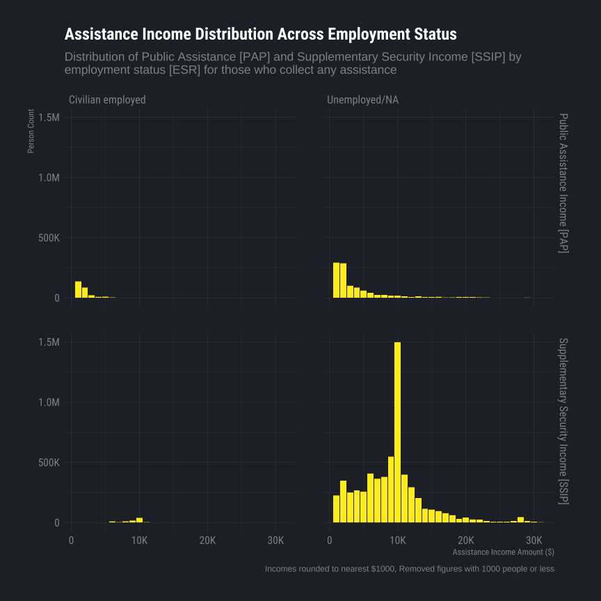<!-- -->

Here we see a comparison of the frequency and quantity of public
assistance income between employed and unemployed individuals who
collected any assistance as well as two different systems of public
assistance income.

Very clearly, unemployed people, or those who are out of the labor
force, are more likely to be collecting some amount of assistance
income, likely because that is a major criteria to whether or not they
are eligible for these programs. Supplementary Security Income \[SSIP\]
is only available to those over 65 or those dealing with a disability,
and is mostly a standardized program, which is why we see the vast
amount of people receiving ~\$10k.

``` r
  read_csv("exported-graph-construction-data/m2-2.csv") |>
  ggplot(aes(x=AssistanceIncomeRatio, y=PWGTP)) + geom_col(fill=ft_cols$yellow, color=NA) + facet_wrap(vars(ESR), ncol=1) + 
  labs(
    title= "Assistance Income Percentage Across Employment Status",
    subtitle=str_wrap("Count of People [PWGTP] by Percentage of Income that comes from Government Assistance for those who collect any assistance", 80),
    x= "Percentage of Income that comes from Government Assistance (%)",
    y= "Person Count",
    caption="Unemployed with 100% of income from assistance amounted to ~4.7m people (~27k employed), removed from plot for visibility"
  ) +
  scale_y_continuous(labels = scales::label_number(scale_cut = scales::cut_short_scale())) +
  scale_x_continuous(labels = scales::label_percent())
```

    ## Rows: 192 Columns: 3
    ## ── Column specification ────────────────────────────────────────────────────────
    ## Delimiter: ","
    ## chr (1): ESR
    ## dbl (2): AssistanceIncomeRatio, PWGTP
    ## 
    ## ℹ Use `spec()` to retrieve the full column specification for this data.
    ## ℹ Specify the column types or set `show_col_types = FALSE` to quiet this message.

    ## Warning in grid.Call(C_textBounds, as.graphicsAnnot(x$label), x$x, x$y, : font
    ## family 'Roboto Condensed Light' not found, will use 'sans' instead
    ## Warning in grid.Call(C_textBounds, as.graphicsAnnot(x$label), x$x, x$y, : font
    ## family 'Roboto Condensed Light' not found, will use 'sans' instead
    ## Warning in grid.Call(C_textBounds, as.graphicsAnnot(x$label), x$x, x$y, : font
    ## family 'Roboto Condensed Light' not found, will use 'sans' instead
    ## Warning in grid.Call(C_textBounds, as.graphicsAnnot(x$label), x$x, x$y, : font
    ## family 'Roboto Condensed Light' not found, will use 'sans' instead
    ## Warning in grid.Call(C_textBounds, as.graphicsAnnot(x$label), x$x, x$y, : font
    ## family 'Roboto Condensed Light' not found, will use 'sans' instead

    ## Warning in grid.Call.graphics(C_text, as.graphicsAnnot(x$label), x$x, x$y, :
    ## font family 'Roboto Condensed Light' not found, will use 'sans' instead
    ## Warning in grid.Call.graphics(C_text, as.graphicsAnnot(x$label), x$x, x$y, :
    ## font family 'Roboto Condensed Light' not found, will use 'sans' instead
    ## Warning in grid.Call.graphics(C_text, as.graphicsAnnot(x$label), x$x, x$y, :
    ## font family 'Roboto Condensed Light' not found, will use 'sans' instead
    ## Warning in grid.Call.graphics(C_text, as.graphicsAnnot(x$label), x$x, x$y, :
    ## font family 'Roboto Condensed Light' not found, will use 'sans' instead
    ## Warning in grid.Call.graphics(C_text, as.graphicsAnnot(x$label), x$x, x$y, :
    ## font family 'Roboto Condensed Light' not found, will use 'sans' instead
    ## Warning in grid.Call.graphics(C_text, as.graphicsAnnot(x$label), x$x, x$y, :
    ## font family 'Roboto Condensed Light' not found, will use 'sans' instead
    ## Warning in grid.Call.graphics(C_text, as.graphicsAnnot(x$label), x$x, x$y, :
    ## font family 'Roboto Condensed Light' not found, will use 'sans' instead
    ## Warning in grid.Call.graphics(C_text, as.graphicsAnnot(x$label), x$x, x$y, :
    ## font family 'Roboto Condensed Light' not found, will use 'sans' instead
    ## Warning in grid.Call.graphics(C_text, as.graphicsAnnot(x$label), x$x, x$y, :
    ## font family 'Roboto Condensed Light' not found, will use 'sans' instead
    ## Warning in grid.Call.graphics(C_text, as.graphicsAnnot(x$label), x$x, x$y, :
    ## font family 'Roboto Condensed Light' not found, will use 'sans' instead
    ## Warning in grid.Call.graphics(C_text, as.graphicsAnnot(x$label), x$x, x$y, :
    ## font family 'Roboto Condensed Light' not found, will use 'sans' instead

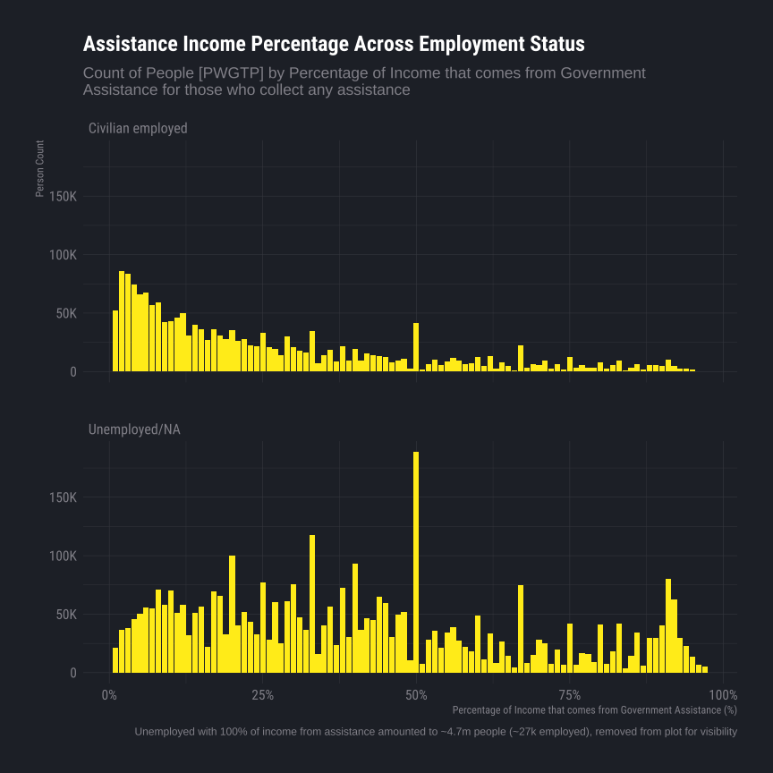<!-- -->

Plotted here is a similar graph as previous, this time looking into
assistance income as a whole (a combination of Public Assistance Income
\[PAP\] and Supplementary Security Income \[SSIP\]) and its proportion
of total income.

For civilians we see as expected. Since they are employed, they should
have an income stream, and therefore assistance is only a limited
portion of their total income. We see a decreasing slope as we go down
and a bump up at 50% as well as 100% (not charted) which is consistent.

For unemployed, we see a major jump at 100% (Nearly 5 million people,
not charted), and a relatively small increase at 50% (~185k). The trends
here are not obvious and likely a result of multiple influencing factors
(i.e. unemployment type and reason, length of unemployment, changing
policy and eligibility, etc.).

### Income & Education Level (Jacob Doh)

How does educational attainment relate to income? Do higher education
levels tend to earn higher income?

In this part, we analyze how total income varies across different levels
of educational attainment. SCHL represents education attainment, and
PINCP represents total income.

``` r
read_csv("exported-graph-construction-data/m3-1.csv") |>
  # factors are removed after putting in CSV, since R reads it as characters anyways
  mutate(SCHL_grouped = factor(SCHL_grouped, ordered=TRUE, levels=c(
    "N/A",
    "Pre-diploma grade",
    "GED or alternative credential",
    "Regular high school diploma",
    "Pre-degree college",
    "Associates degree",
    "Bachelors degree",
    "Masters degree",
    "Doctorate degree"
    ))
  ) |>
  
  # creating plot
  ggplot(aes(x = SCHL_grouped, y = PINCP_adjusted)) +
    labs(
      title = "Total Income Across Education Levels", 
      subtitle="Total Income [PINCP] compared across Education Level Attainment [SCHL]",
      x = "Grouped Education Level [SCHL]", 
      y = "Total Income [PINCP] (Adjusted)") +
    geom_boxplot(fill = "#252a32", color = "white") +
    coord_flip() +
    scale_y_continuous(labels = scales::label_number(scale_cut = scales::cut_short_scale()))
```

    ## Rows: 8299 Columns: 3
    ## ── Column specification ────────────────────────────────────────────────────────
    ## Delimiter: ","
    ## chr (1): SCHL_grouped
    ## dbl (2): sum(PWGTP), PINCP_adjusted
    ## 
    ## ℹ Use `spec()` to retrieve the full column specification for this data.
    ## ℹ Specify the column types or set `show_col_types = FALSE` to quiet this message.

    ## Warning: Removed 2 rows containing non-finite outside the scale range
    ## (`stat_boxplot()`).

    ## Warning in grid.Call(C_textBounds, as.graphicsAnnot(x$label), x$x, x$y, : font
    ## family 'Roboto Condensed Light' not found, will use 'sans' instead
    ## Warning in grid.Call(C_textBounds, as.graphicsAnnot(x$label), x$x, x$y, : font
    ## family 'Roboto Condensed Light' not found, will use 'sans' instead

    ## Warning in grid.Call.graphics(C_text, as.graphicsAnnot(x$label), x$x, x$y, :
    ## font family 'Roboto Condensed Light' not found, will use 'sans' instead
    ## Warning in grid.Call.graphics(C_text, as.graphicsAnnot(x$label), x$x, x$y, :
    ## font family 'Roboto Condensed Light' not found, will use 'sans' instead
    ## Warning in grid.Call.graphics(C_text, as.graphicsAnnot(x$label), x$x, x$y, :
    ## font family 'Roboto Condensed Light' not found, will use 'sans' instead
    ## Warning in grid.Call.graphics(C_text, as.graphicsAnnot(x$label), x$x, x$y, :
    ## font family 'Roboto Condensed Light' not found, will use 'sans' instead

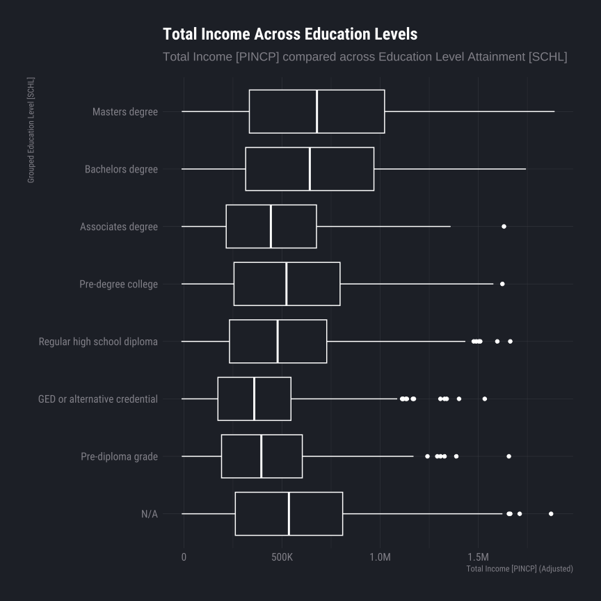<!-- -->

The above result (box plot) shows adjusted total income (PINCP_adjusted)
by level of educational attainment (SCHL). Each box shows the income
distribution for a particular level of education including median,
spread and possible outliers. We can see that there is a clear positive
relationship between education level and income. Specifically, higher
education attainment (master’s and bachelor’s) is generally correlated
with higher median income compared to lower education attainment (high
school and GED). Also, the median income rises with education level,
which suggests that higher education not only earn more on average, but
also experience greater variability (due to wide range of opportunities
and occupations). But median income is lower for lower-education groups,
and they are more concentrated (income distributions appear lower and a
bit narrower). Overall the results show a clear positive pattern between
income and educational attainment. This result answers the research
question directly. Income does vary by level of education, and higher
levels of education are associated with higher income.

### Income & Poverty Ratio (Jacob Doh)

How does income relate to poverty status? Do average income levels
differ across poverty groups?

In this part, we analyze how total relates to poverty status. The
income-to-poverty ratio is represented as POVPIP, and total income is
represented as PINCP (Income is adjusted using ADJINC).

``` r
g3.bin_width <- 1000 # income bin width
```

``` r
read_csv("exported-graph-construction-data/m4-1.csv") |>
  mutate(POVPIP_grouped = factor(POVPIP_grouped,
  levels = c(
  "Extreme Poverty (<50)",
  "Below Poverty Line (50-99)",
  "Low Income (100-199)",
  "Middle Income (200-399)",
  "High Income (400+)"))) |>

  # creating plot
  ggplot(aes(x = POVPIP_grouped, y = avg_income)) +
  geom_col(fill = ft_cols$yellow, color=NA) +
  coord_flip() +
  labs(
    title = "Average Income Across Poverty Levels",
    x = "Poverty Level (POVPIP)",
    y = "Adjusted Income") +
  scale_y_continuous(labels = scales::label_number(scale_cut = scales::cut_short_scale()))
```

    ## Rows: 5 Columns: 2
    ## ── Column specification ────────────────────────────────────────────────────────
    ## Delimiter: ","
    ## chr (1): POVPIP_grouped
    ## dbl (1): avg_income
    ## 
    ## ℹ Use `spec()` to retrieve the full column specification for this data.
    ## ℹ Specify the column types or set `show_col_types = FALSE` to quiet this message.

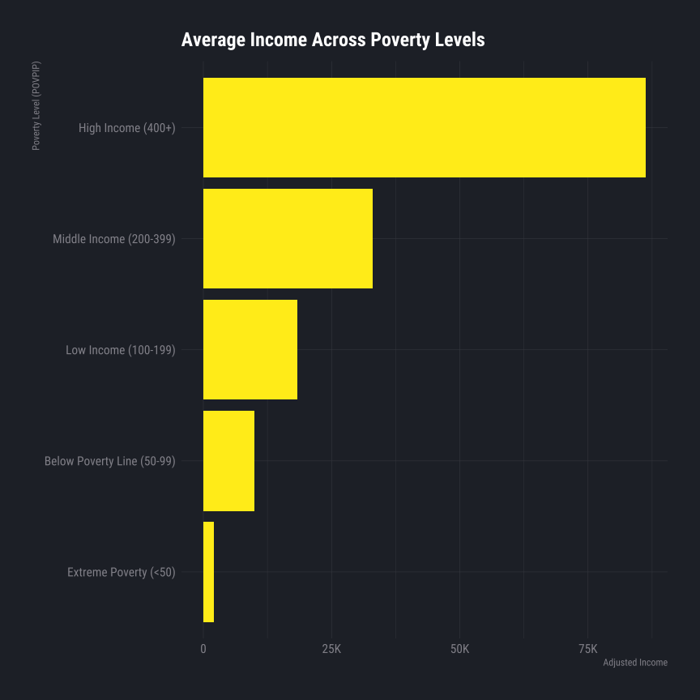<!-- -->

The result above shows the relation between poverty status (POVPIP) and
average adjusted income. As can be seen from the bar chart, there is a
clear increasing trend (as POVPIP increases, average income increases).
The lowest average income is for the extreme poverty category as well.
We can see that income gradually increases as we go from the
below-poverty-line to the low-income group to the middle-income group
(individuals who are higher above the poverty threshold tend to earn
more on average). The average for the high-income group is much higher
than the average for all other groups. One thing to note is that this
output is based on average income for each group, so it summarizes the
general trend rather than the full distribution of variation. The
overall pattern is very clear and consistent. This result answers our
research question by showing that income levels differ across poverty
groups, and higher POVPIP status is associated with higher average
adjusted income.

### Income & Vehicle Ownership

``` r
g5.bin_width <- 1000 # income bin width
```

``` r
read_csv("exported-graph-construction-data/m5-1.csv") |>
  ggplot(aes(x = reorder(DRIVESP, avg_income), y = avg_income)) +
  geom_col(fill = ft_cols$yellow, color=NA) +
  coord_flip() +
  labs(
    title = "Average Income by Number of Vehicles Available",
    subtitle = str_wrap(
      "Weighted average Total Income by vehicles available for employed civilians",
      80),
    x = "Vehicles Available",
    y = "Average Total Income Adjusted"
  ) +
  scale_y_continuous(labels = scales::label_number(scale_cut = scales::cut_short_scale()))
```

    ## Rows: 6 Columns: 2
    ## ── Column specification ────────────────────────────────────────────────────────
    ## Delimiter: ","
    ## chr (1): DRIVESP
    ## dbl (1): avg_income
    ## 
    ## ℹ Use `spec()` to retrieve the full column specification for this data.
    ## ℹ Specify the column types or set `show_col_types = FALSE` to quiet this message.

    ## Warning in grid.Call(C_textBounds, as.graphicsAnnot(x$label), x$x, x$y, : font
    ## family 'Roboto Condensed Light' not found, will use 'sans' instead
    ## Warning in grid.Call(C_textBounds, as.graphicsAnnot(x$label), x$x, x$y, : font
    ## family 'Roboto Condensed Light' not found, will use 'sans' instead

    ## Warning in grid.Call.graphics(C_text, as.graphicsAnnot(x$label), x$x, x$y, :
    ## font family 'Roboto Condensed Light' not found, will use 'sans' instead
    ## Warning in grid.Call.graphics(C_text, as.graphicsAnnot(x$label), x$x, x$y, :
    ## font family 'Roboto Condensed Light' not found, will use 'sans' instead
    ## Warning in grid.Call.graphics(C_text, as.graphicsAnnot(x$label), x$x, x$y, :
    ## font family 'Roboto Condensed Light' not found, will use 'sans' instead
    ## Warning in grid.Call.graphics(C_text, as.graphicsAnnot(x$label), x$x, x$y, :
    ## font family 'Roboto Condensed Light' not found, will use 'sans' instead

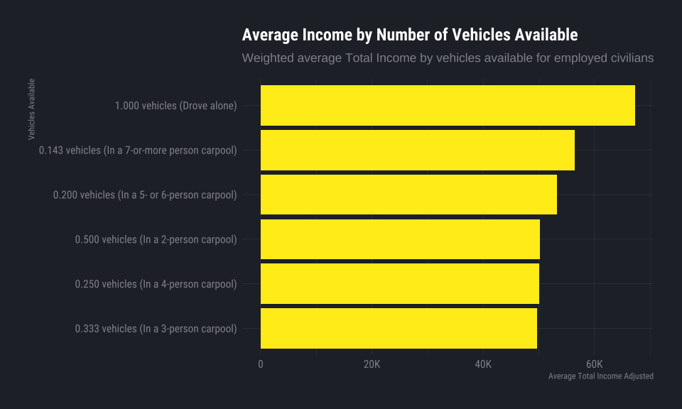<!-- -->

``` r
read_csv("exported-graph-construction-data/m5-2.csv") |>
  ggplot(aes(
    x = has_vehicle,
    ymin = ymin, ymax = ymax,
    lower = lower, middle = middle, upper = upper
  )) +
  geom_boxplot(stat = "identity", color = ft_cols$white, fill = "#252a32") +
  labs(
    title   = "Commute Time Distribution by Vehicle Access",
    subtitle = str_wrap(
      "Travel Time to Work by whether the respondent has access to a vehicle",
      80),
    x = "Vehicle Access",
    y = "Travel Time to Work in Minutes"
  ) # This graph doesn't really pertain to anything we are doing, nor does it make sense.
```

    ## Rows: 1 Columns: 6
    ## ── Column specification ────────────────────────────────────────────────────────
    ## Delimiter: ","
    ## chr (1): has_vehicle
    ## dbl (5): ymin, lower, middle, upper, ymax
    ## 
    ## ℹ Use `spec()` to retrieve the full column specification for this data.
    ## ℹ Specify the column types or set `show_col_types = FALSE` to quiet this message.

    ## Warning in grid.Call(C_textBounds, as.graphicsAnnot(x$label), x$x, x$y, : font
    ## family 'Roboto Condensed Light' not found, will use 'sans' instead
    ## Warning in grid.Call(C_textBounds, as.graphicsAnnot(x$label), x$x, x$y, : font
    ## family 'Roboto Condensed Light' not found, will use 'sans' instead

    ## Warning in grid.Call.graphics(C_text, as.graphicsAnnot(x$label), x$x, x$y, :
    ## font family 'Roboto Condensed Light' not found, will use 'sans' instead
    ## Warning in grid.Call.graphics(C_text, as.graphicsAnnot(x$label), x$x, x$y, :
    ## font family 'Roboto Condensed Light' not found, will use 'sans' instead
    ## Warning in grid.Call.graphics(C_text, as.graphicsAnnot(x$label), x$x, x$y, :
    ## font family 'Roboto Condensed Light' not found, will use 'sans' instead
    ## Warning in grid.Call.graphics(C_text, as.graphicsAnnot(x$label), x$x, x$y, :
    ## font family 'Roboto Condensed Light' not found, will use 'sans' instead

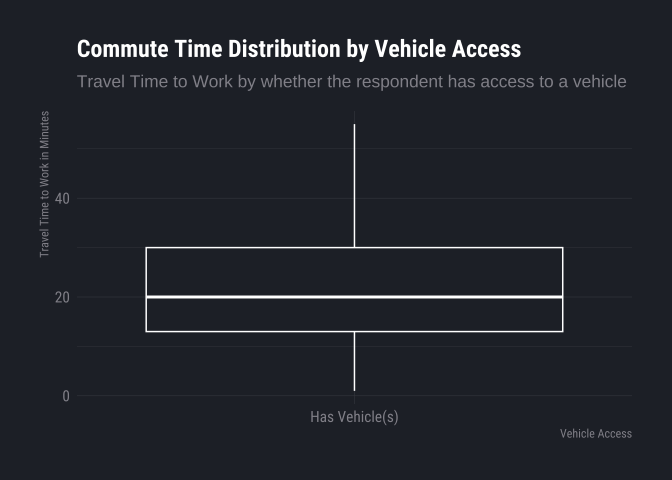<!-- -->

### Income & Class of Worker

``` r
g6.bin_width <- 1000 # income bin width
```

``` r
read_csv("exported-graph-construction-data/m6-1.csv") |>
  ggplot(aes(
    x = reorder(COW_grouped, middle),
    ymin = ymin, ymax = ymax,
    lower = lower, middle = middle, upper = upper
  )) +
  geom_boxplot(stat = "identity", color = ft_cols$white, fill = "#252a32") +
  coord_flip() +
  labs(
    title   = "Total Income Distribution by Employment Class",
    subtitle = str_wrap(
      "Total Income adjusted across Class of Worker groups for employed civilians",
      80),
    x = "Class of Worker",
    y = "Total Income Adjusted"
  ) +
  scale_y_continuous(labels = scales::label_number(scale_cut = scales::cut_short_scale()))
```

    ## Rows: 4 Columns: 6
    ## ── Column specification ────────────────────────────────────────────────────────
    ## Delimiter: ","
    ## chr (1): COW_grouped
    ## dbl (5): ymin, lower, middle, upper, ymax
    ## 
    ## ℹ Use `spec()` to retrieve the full column specification for this data.
    ## ℹ Specify the column types or set `show_col_types = FALSE` to quiet this message.

    ## Warning in grid.Call(C_textBounds, as.graphicsAnnot(x$label), x$x, x$y, : font
    ## family 'Roboto Condensed Light' not found, will use 'sans' instead
    ## Warning in grid.Call(C_textBounds, as.graphicsAnnot(x$label), x$x, x$y, : font
    ## family 'Roboto Condensed Light' not found, will use 'sans' instead

    ## Warning in grid.Call.graphics(C_text, as.graphicsAnnot(x$label), x$x, x$y, :
    ## font family 'Roboto Condensed Light' not found, will use 'sans' instead
    ## Warning in grid.Call.graphics(C_text, as.graphicsAnnot(x$label), x$x, x$y, :
    ## font family 'Roboto Condensed Light' not found, will use 'sans' instead
    ## Warning in grid.Call.graphics(C_text, as.graphicsAnnot(x$label), x$x, x$y, :
    ## font family 'Roboto Condensed Light' not found, will use 'sans' instead
    ## Warning in grid.Call.graphics(C_text, as.graphicsAnnot(x$label), x$x, x$y, :
    ## font family 'Roboto Condensed Light' not found, will use 'sans' instead

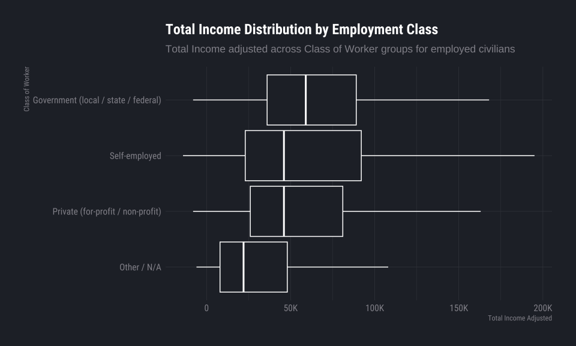<!-- -->

``` r
read_csv("exported-graph-construction-data/m6-2.csv") |>
  filter(COW_grouped != "Other / N/A") |>
  ggplot(aes(x = reorder(COW_grouped, proportion), y = proportion)) +
  geom_col(fill = ft_cols$yellow, color=NA) +
  coord_flip() +
  labs(
    title   = "Share of Employed Workers by Class",
    subtitle = str_wrap(
      "Weighted proportion of employed civilians by Class of Worker",
      80),
    x = "Class of Worker",
    y = "Proportion of Workers"
  ) +
  scale_y_continuous(labels = scales::label_percent())
```

    ## Rows: 4 Columns: 3
    ## ── Column specification ────────────────────────────────────────────────────────
    ## Delimiter: ","
    ## chr (1): COW_grouped
    ## dbl (2): total_weight, proportion
    ## 
    ## ℹ Use `spec()` to retrieve the full column specification for this data.
    ## ℹ Specify the column types or set `show_col_types = FALSE` to quiet this message.

    ## Warning in grid.Call(C_textBounds, as.graphicsAnnot(x$label), x$x, x$y, : font
    ## family 'Roboto Condensed Light' not found, will use 'sans' instead
    ## Warning in grid.Call(C_textBounds, as.graphicsAnnot(x$label), x$x, x$y, : font
    ## family 'Roboto Condensed Light' not found, will use 'sans' instead

    ## Warning in grid.Call.graphics(C_text, as.graphicsAnnot(x$label), x$x, x$y, :
    ## font family 'Roboto Condensed Light' not found, will use 'sans' instead
    ## Warning in grid.Call.graphics(C_text, as.graphicsAnnot(x$label), x$x, x$y, :
    ## font family 'Roboto Condensed Light' not found, will use 'sans' instead
    ## Warning in grid.Call.graphics(C_text, as.graphicsAnnot(x$label), x$x, x$y, :
    ## font family 'Roboto Condensed Light' not found, will use 'sans' instead
    ## Warning in grid.Call.graphics(C_text, as.graphicsAnnot(x$label), x$x, x$y, :
    ## font family 'Roboto Condensed Light' not found, will use 'sans' instead

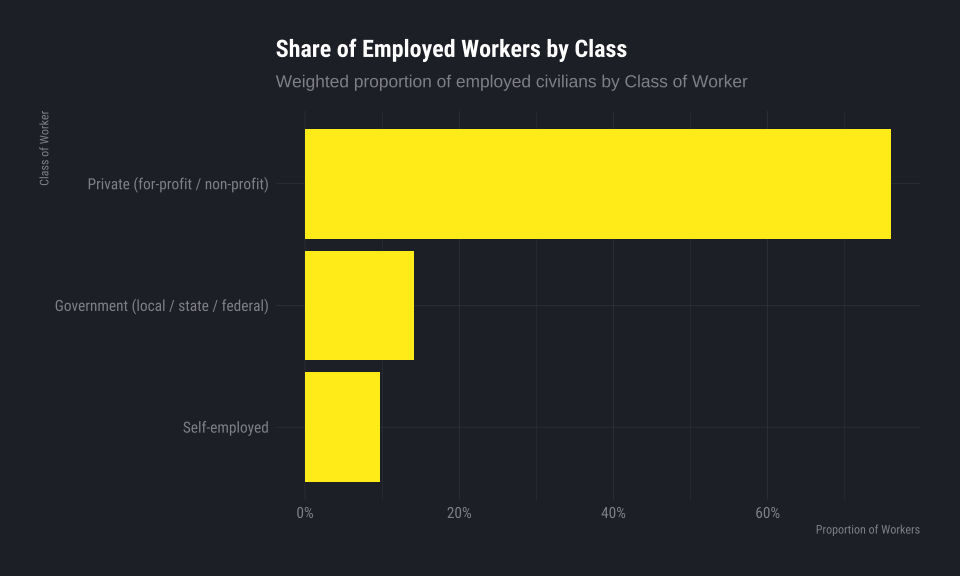<!-- -->

### Income & Race (Sebastian Naranjo)

``` r
g7.bin_width <- 1000 # income bin width
```

``` r
read_csv("exported-graph-construction-data/m7-1.csv") |>
ggplot(aes(x = reorder(RAC1P, weighted_median), y = weighted_median)) +

  geom_col(width = 0.65, fill= ft_cols$yellow,
    color=NA) +

  geom_text(
    aes(label = scales::label_dollar(scale_cut = scales::cut_short_scale())(weighted_median)
    ),
    hjust = -0.1,

  ) +

  coord_flip() +

  labs(
    title = "Median Income by Racial Group",
    subtitle = "Median Total Person Income [PINCP] by Race [RAC1P]",
    x = "Race Group Recode [RAC1P]",
    y = "Median Total Income ($)",
    caption = "Incomes rounded to nearest $1000,"
  ) +

  scale_y_continuous(
    labels = scales::label_dollar(scale_cut = scales::cut_short_scale()),
    expand = expansion(mult = c(0, 0.1))
  )
```

    ## Rows: 7 Columns: 3
    ## ── Column specification ────────────────────────────────────────────────────────
    ## Delimiter: ","
    ## chr (1): RAC1P
    ## dbl (2): weighted_median, weighted_mean
    ## 
    ## ℹ Use `spec()` to retrieve the full column specification for this data.
    ## ℹ Specify the column types or set `show_col_types = FALSE` to quiet this message.

    ## Warning in grid.Call(C_textBounds, as.graphicsAnnot(x$label), x$x, x$y, : font
    ## family 'Roboto Condensed Light' not found, will use 'sans' instead
    ## Warning in grid.Call(C_textBounds, as.graphicsAnnot(x$label), x$x, x$y, : font
    ## family 'Roboto Condensed Light' not found, will use 'sans' instead
    ## Warning in grid.Call(C_textBounds, as.graphicsAnnot(x$label), x$x, x$y, : font
    ## family 'Roboto Condensed Light' not found, will use 'sans' instead
    ## Warning in grid.Call(C_textBounds, as.graphicsAnnot(x$label), x$x, x$y, : font
    ## family 'Roboto Condensed Light' not found, will use 'sans' instead

    ## Warning in grid.Call.graphics(C_text, as.graphicsAnnot(x$label), x$x, x$y, :
    ## font family 'Roboto Condensed Light' not found, will use 'sans' instead
    ## Warning in grid.Call.graphics(C_text, as.graphicsAnnot(x$label), x$x, x$y, :
    ## font family 'Roboto Condensed Light' not found, will use 'sans' instead
    ## Warning in grid.Call.graphics(C_text, as.graphicsAnnot(x$label), x$x, x$y, :
    ## font family 'Roboto Condensed Light' not found, will use 'sans' instead
    ## Warning in grid.Call.graphics(C_text, as.graphicsAnnot(x$label), x$x, x$y, :
    ## font family 'Roboto Condensed Light' not found, will use 'sans' instead
    ## Warning in grid.Call.graphics(C_text, as.graphicsAnnot(x$label), x$x, x$y, :
    ## font family 'Roboto Condensed Light' not found, will use 'sans' instead
    ## Warning in grid.Call.graphics(C_text, as.graphicsAnnot(x$label), x$x, x$y, :
    ## font family 'Roboto Condensed Light' not found, will use 'sans' instead
    ## Warning in grid.Call.graphics(C_text, as.graphicsAnnot(x$label), x$x, x$y, :
    ## font family 'Roboto Condensed Light' not found, will use 'sans' instead
    ## Warning in grid.Call.graphics(C_text, as.graphicsAnnot(x$label), x$x, x$y, :
    ## font family 'Roboto Condensed Light' not found, will use 'sans' instead

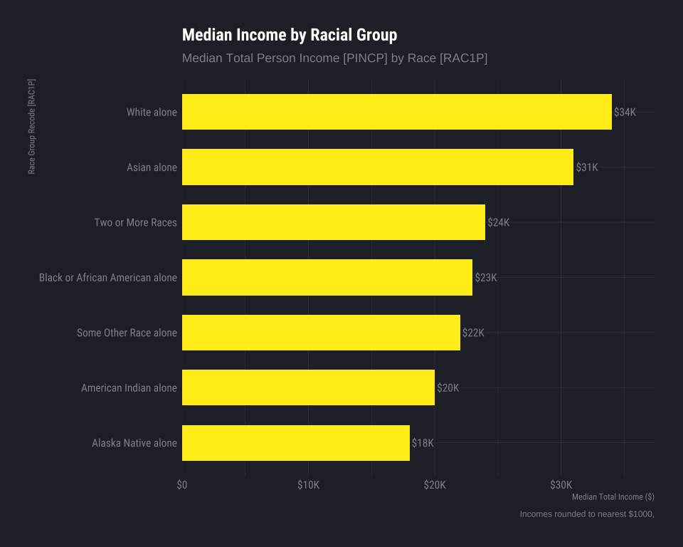<!-- -->

``` r
read_csv("exported-graph-construction-data/m7-2.csv") |>
  ggplot(aes(
    x=RAC1P, ymin = ymin, ymax = ymax,
    lower = lower, middle = middle, upper = upper
  )) + 
  geom_boxplot(
    stat = "identity",
    fill = "#252a32",
    color = "white",
    outlier.alpha = 0.1,
    width = 0.6
  ) +

  coord_flip() +

  scale_y_continuous(labels = scales::label_number(scale_cut = scales::cut_short_scale())) +

  labs(
    title = "Income Distribution Across Racial Groups",
    x = "Race Group Recode [RAC1P]",
    y = "Total Income ($)"
  )
```

    ## Rows: 7 Columns: 6
    ## ── Column specification ────────────────────────────────────────────────────────
    ## Delimiter: ","
    ## chr (1): RAC1P
    ## dbl (5): ymin, lower, middle, upper, ymax
    ## 
    ## ℹ Use `spec()` to retrieve the full column specification for this data.
    ## ℹ Specify the column types or set `show_col_types = FALSE` to quiet this message.

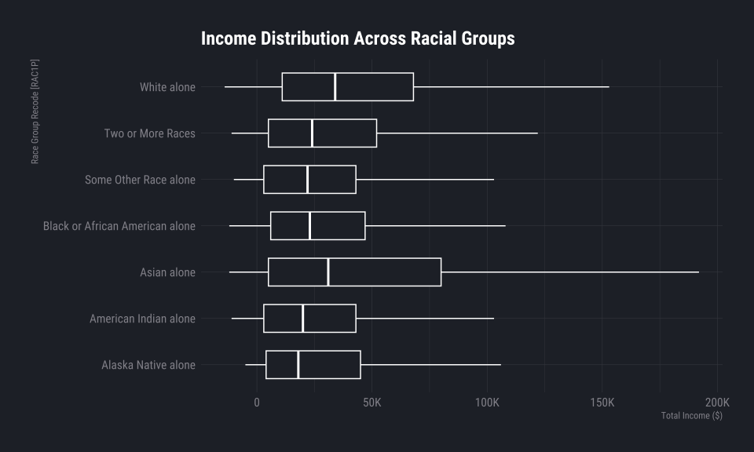<!-- -->

Overall, while median income varies across racial groups—most notably
with White individuals exhibiting the highest median adjusted income—the
boxplot reveals substantial within-group variability and overlapping
distributions. This suggests that race is associated with income
differences at the population level, but it is not a deterministic
predictor of individual economic outcomes.

Query

### Income & Region (Sebastian Naranjo)

``` r
read_csv("exported-graph-construction-data/m8-1.csv") |>
ggplot(aes(x = REGION, y = weighted_mean)) +

  geom_col(fill = ft_cols$yellow, color=NA, width = 0.65) +

  geom_text(
    aes(label = scales::label_dollar(scale_cut = scales::cut_short_scale())(weighted_mean)),
    vjust = -0.5,
    size = 4
  ) +

  labs(
    title = "Average Income by U.S. Region",
    subtitle = "Average Total Person Income [PINCP] by Region of Residence [REGION]",
    x = "Region [REGION]",
    y = "Average Income ($)"
  ) +

  scale_y_continuous(
    labels = scales::label_dollar(scale_cut = scales::cut_short_scale()),
    expand = expansion(mult = c(0, 0.1))
  )
```

    ## Rows: 4 Columns: 3
    ## ── Column specification ────────────────────────────────────────────────────────
    ## Delimiter: ","
    ## chr (1): REGION
    ## dbl (2): weighted_median, weighted_mean
    ## 
    ## ℹ Use `spec()` to retrieve the full column specification for this data.
    ## ℹ Specify the column types or set `show_col_types = FALSE` to quiet this message.

    ## Warning in grid.Call(C_textBounds, as.graphicsAnnot(x$label), x$x, x$y, : font
    ## family 'Roboto Condensed Light' not found, will use 'sans' instead
    ## Warning in grid.Call(C_textBounds, as.graphicsAnnot(x$label), x$x, x$y, : font
    ## family 'Roboto Condensed Light' not found, will use 'sans' instead

    ## Warning in grid.Call.graphics(C_text, as.graphicsAnnot(x$label), x$x, x$y, :
    ## font family 'Roboto Condensed Light' not found, will use 'sans' instead
    ## Warning in grid.Call.graphics(C_text, as.graphicsAnnot(x$label), x$x, x$y, :
    ## font family 'Roboto Condensed Light' not found, will use 'sans' instead
    ## Warning in grid.Call.graphics(C_text, as.graphicsAnnot(x$label), x$x, x$y, :
    ## font family 'Roboto Condensed Light' not found, will use 'sans' instead
    ## Warning in grid.Call.graphics(C_text, as.graphicsAnnot(x$label), x$x, x$y, :
    ## font family 'Roboto Condensed Light' not found, will use 'sans' instead

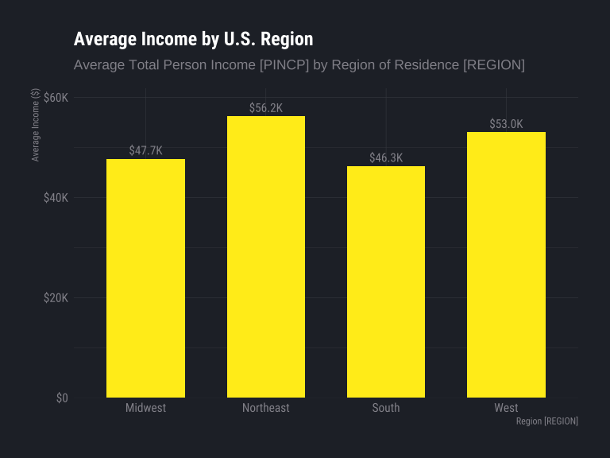<!-- -->

The analysis indicates that the Northeast has the highest weighted
average income, followed by the West, Midwest, and South. While regional
differences are statistically meaningful, they are relatively modest
compared to within-region variation, suggesting that geographic location
influences income but does not dominate individual economic outcomes.

## Conclusion

Overall, this analysis portrays that income is connected to many
different factors (demographics, geographic location, commute,
employment, and others). By analyzing these different questions, we are
able to analyze that the income is not explained by one single variable.
Instead, income is shaped by a different combination of education,
employment, transportation, location, and demographic factors. In
conclusion, our analysis shows that income differences are strongly
related to education poverty status, employment, transportation, race,
and geography. The project helps understand that income is complex and
cannot be fully analyzed from only one factor. Therefore, future
analysis could be improved by using more detailed statistical models or
by comparing changes over time to better understand how these
relationships develop.

## Supplementary Exhibits

### Exhibit A

``` r
  read_csv("exported-graph-construction-data/exhibit-a.csv") |>
  ggplot(aes(x=SEMP_Ratio, y=prop, fill=JWTRNS )) + geom_col(position="dodge") + # facet_wrap(vars(JWTRNS)) +
  labs(
    x="% Self Employed Income Gain (Loss) contribution to Total Income Lost", 
    y="Proportion of Occurances", 
    title= str_wrap("Exhibit A: Total Income Loss Occurances & Self Employed Income", 70),
    subtitle=str_wrap("Analysis of Total Income [PINCP] Loss Occurances & the Proportional Self Employed Income [SEMP] Impact",70),
    caption="Proportions Rounded to the nearest 100%"
     ) + scale_fill_ft()
```

    ## Rows: 10 Columns: 4
    ## ── Column specification ────────────────────────────────────────────────────────
    ## Delimiter: ","
    ## chr (1): JWTRNS
    ## dbl (3): SEMP_Ratio, n, prop
    ## 
    ## ℹ Use `spec()` to retrieve the full column specification for this data.
    ## ℹ Specify the column types or set `show_col_types = FALSE` to quiet this message.

    ## Warning in grid.Call(C_textBounds, as.graphicsAnnot(x$label), x$x, x$y, : font
    ## family 'Roboto Condensed Light' not found, will use 'sans' instead
    ## Warning in grid.Call(C_textBounds, as.graphicsAnnot(x$label), x$x, x$y, : font
    ## family 'Roboto Condensed Light' not found, will use 'sans' instead
    ## Warning in grid.Call(C_textBounds, as.graphicsAnnot(x$label), x$x, x$y, : font
    ## family 'Roboto Condensed Light' not found, will use 'sans' instead
    ## Warning in grid.Call(C_textBounds, as.graphicsAnnot(x$label), x$x, x$y, : font
    ## family 'Roboto Condensed Light' not found, will use 'sans' instead
    ## Warning in grid.Call(C_textBounds, as.graphicsAnnot(x$label), x$x, x$y, : font
    ## family 'Roboto Condensed Light' not found, will use 'sans' instead

    ## Warning in grid.Call.graphics(C_text, as.graphicsAnnot(x$label), x$x, x$y, :
    ## font family 'Roboto Condensed Light' not found, will use 'sans' instead
    ## Warning in grid.Call.graphics(C_text, as.graphicsAnnot(x$label), x$x, x$y, :
    ## font family 'Roboto Condensed Light' not found, will use 'sans' instead
    ## Warning in grid.Call.graphics(C_text, as.graphicsAnnot(x$label), x$x, x$y, :
    ## font family 'Roboto Condensed Light' not found, will use 'sans' instead
    ## Warning in grid.Call.graphics(C_text, as.graphicsAnnot(x$label), x$x, x$y, :
    ## font family 'Roboto Condensed Light' not found, will use 'sans' instead
    ## Warning in grid.Call.graphics(C_text, as.graphicsAnnot(x$label), x$x, x$y, :
    ## font family 'Roboto Condensed Light' not found, will use 'sans' instead
    ## Warning in grid.Call.graphics(C_text, as.graphicsAnnot(x$label), x$x, x$y, :
    ## font family 'Roboto Condensed Light' not found, will use 'sans' instead
    ## Warning in grid.Call.graphics(C_text, as.graphicsAnnot(x$label), x$x, x$y, :
    ## font family 'Roboto Condensed Light' not found, will use 'sans' instead
    ## Warning in grid.Call.graphics(C_text, as.graphicsAnnot(x$label), x$x, x$y, :
    ## font family 'Roboto Condensed Light' not found, will use 'sans' instead
    ## Warning in grid.Call.graphics(C_text, as.graphicsAnnot(x$label), x$x, x$y, :
    ## font family 'Roboto Condensed Light' not found, will use 'sans' instead
    ## Warning in grid.Call.graphics(C_text, as.graphicsAnnot(x$label), x$x, x$y, :
    ## font family 'Roboto Condensed Light' not found, will use 'sans' instead
    ## Warning in grid.Call.graphics(C_text, as.graphicsAnnot(x$label), x$x, x$y, :
    ## font family 'Roboto Condensed Light' not found, will use 'sans' instead

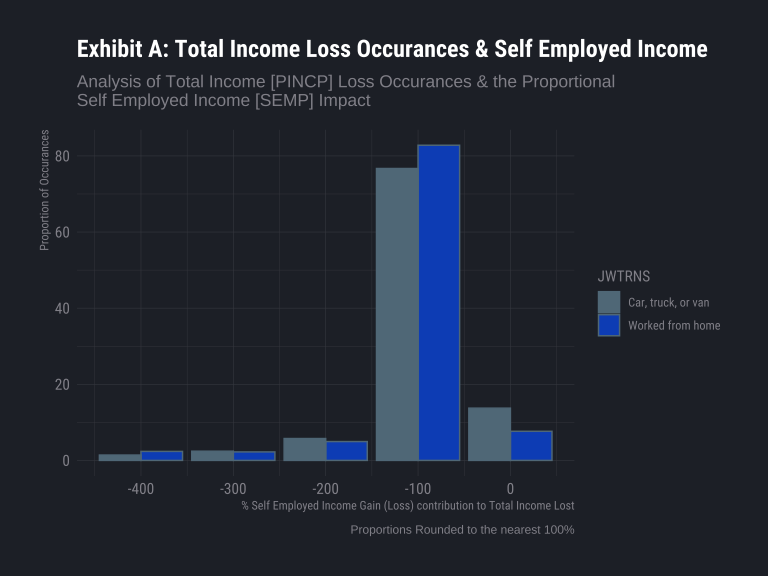<!-- -->

This graph shows only occurrences of total income being a loss, and self
employed incomes impact on that resulting negative total as a proportion
of itself. Here we see about 82% of people who work from home who had
negative total incomes had self employed income contributing to a
rounded 100% of that loss. So for example, someone who lost \$100,000 in
this category attributes that 100% of that loss is due to self
employment income. We see values greater then 100% due to the counter
balancing effect of other incomes.
